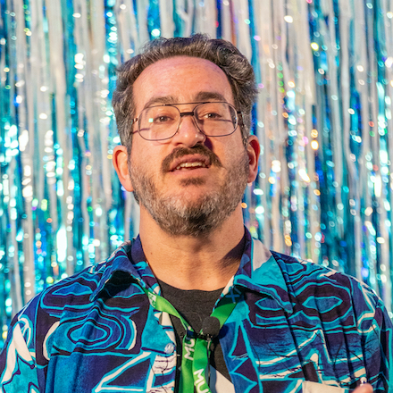

To quote
[24601](https://www.youtube.com/watch?v=TrPCWfB-Jdo){:rel="nofollow" target="_new"},
who am I?

{:class="about-me-pic img-responsive"}
{:class="center"}

I am Dave Aronson,
a semi-retired software development consultant
(meaning I write code _and_ give advice about how),
with professional experience dating back to 1983,
in a wide variety of languages, system, techniques, and domains.&nbsp;
Since 2011,
I've mostly been doing Ruby,
and before that, mostly (plain old) C.&nbsp;
The rest of it has been in many other languages,
most notably Python, SQL, and the nearly-inescapable JavaScript,
plus many older or more obscure ones I won't mention here.&nbsp;
Now I'm trying to break into Elixir,
having been learning it on and off for a few years,
including some open source contributions,
but I haven't landed any _paid_ work in it yet.

I first started freelancing in 1990,
having had my third layoff.&nbsp;
In the pre-web days,
both work and I were _much_ harder to find.&nbsp;
So, almost three years later,
I went back to the "real job" world,
though I did occasional freelance projects
on evenings, weekends, and between "permanent" positions.&nbsp;
Fast-forwarding to 2011,
I wanted to break into more modern languages
(including some I had taught myself over the years),
and felt that freelancing was the best way to do that,
so I tried that again &mdash;
and this time it worked much better!

Aside from actual hands-on software development,
I also enjoy [speaking at conferences](speaking),
especially in interesting places
where I can take a few extra days to play tourist.&nbsp;
(The picture above is from
[JSConf Hawai'i](https://www.jsconfhi.com/){:rel="nofollow" target="_new"}
2020.)

I am married to a smart cutie who doesn't like publicity,
so no more details there.&nbsp;
We live in
[City of Fairfax, VA](https://www.google.com/maps/place/Fairfax,+Virginia/){:rel="nofollow" target="_new"}
(a suburb of Washington, DC),
and are owned by two cats.

In my spare time,
I make
[mead](https://en.wikipedia.org/wiki/Mead){:rel="nofollow" target="_new"},
maintain
[a website about it](https://www.SumOfABatch.com/){:target="_new"},
record
[videos about making mead simply](https://www.SumOfABatch.com/videos){:target="_new"},
and run [workshops to teach that](https://www.SumOfABatch.com/workshops){:target="_new"}.
